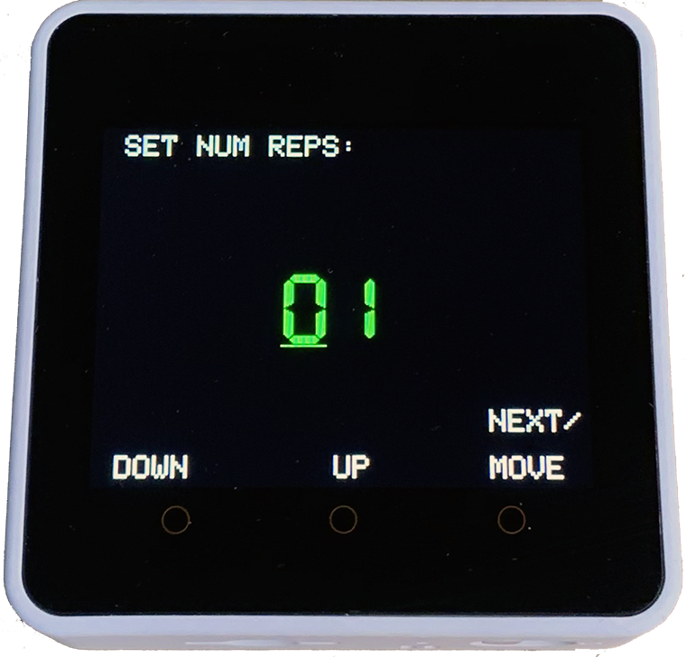

# M5Stack-Core2-Interval-Timer
Countdown Interval Timer using M5Stack Core2 &amp; LovyanGFX - aka. HIIT, Gym, Pomodoro, CrossFit Timer

<!-- ABOUT THE PROJECT -->
## About The Project

This project was based on the [Wio Terminal Timer](https://www.hackster.io/SeeedStudio/wio-terminal-timer-6afe8c/) and was developed to see if I could get the LovyaGFX library working with the M5Core2 library. It also demonstrates how use a sound file with the Core2 without an external library.

### Built With

* []  
* [ARDUINO IDE 2](https://www.arduino.cc/en/software) 
* [LovyanGFX](https://github.com/lovyan03/) 
* [Lang-Ship Tools Image Conversion](https://lang-ship.com/tools/image2data/)
* [Lang-Ship Tools Audio Conversion](https://lang-ship.com/tools/wav2data/)

<!-- GETTING STARTED -->
## Getting Started

Ensure you have the current software and libraries installed, upload the code and it should work streight out of the box.
If you decide to use your own welcome image and audio, prepare them in the usual way using the Lang-Ship links. There are other scripts that can achieve this.

<!-- USAGE EXAMPLES -->
## Usage

Use this space to show useful examples of how a project can be used. Additional screenshots, code examples and demos work well in this space. You may also link to more resources.

_For more examples, please refer to the [Documentation](https://example.com)_

<!-- FUTURE UPDATES -->
## Funture Improvements

* The audio beeps could be improved 
* The Set Num Reps should not go past sero
* The M5.BtnC.pressedFor(500) needs inproving
* Reduce flicker, even though using Sprites

