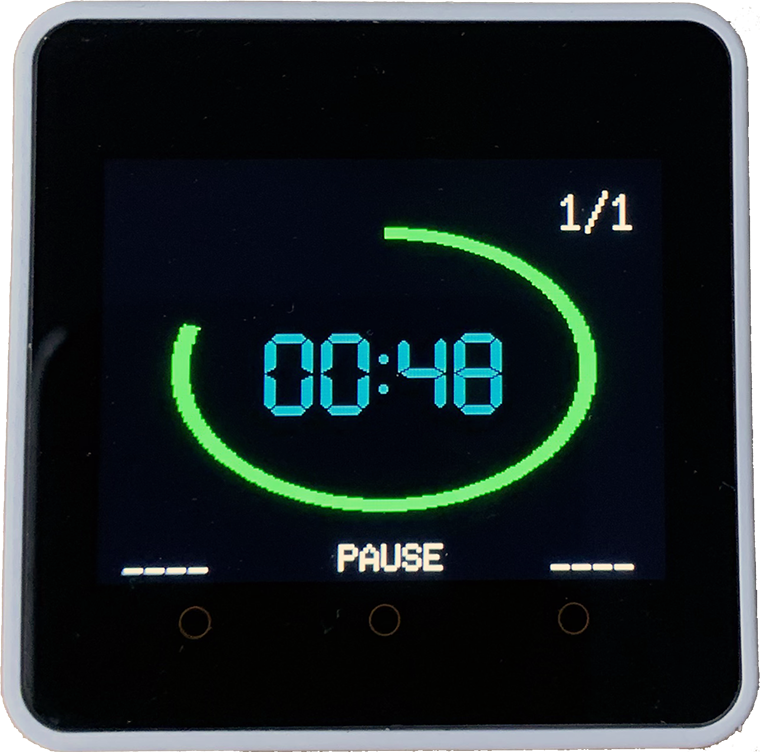

# M5Stack-Core2-Interval-Timer
Countdown Interval Timer using M5Stack Core2 &amp; LovyanGFX - aka. HIIT, Gym, Pomodoro, CrossFit Timer

<!-- ABOUT THE PROJECT -->
## About The Project

This project was based on the [Wio Terminal Timer](https://www.hackster.io/SeeedStudio/wio-terminal-timer-6afe8c/) and was developed to see if I could get the LovyaGFX library working with the M5Core2 library. It also demonstrates how use a sound file with the Core2 without an external library.

### Built With

* [M5Stack Core2](https://shop.m5stack.com/products/m5stack-core2-esp32-iot-development-kit)  
* [ARDUINO IDE 2](https://www.arduino.cc/en/software) 
* [LovyanGFX](https://github.com/lovyan03/) 
* [Lang-Ship Tools Image Conversion](https://lang-ship.com/tools/image2data/)
* [Lang-Ship Tools Audio Conversion](https://lang-ship.com/tools/wav2data/)

<!-- GETTING STARTED -->
## Getting Started

Ensure you have the current software and libraries installed, upload the code and it should work streight out of the box.
If you decide to use your own welcome image and audio, prepare them in the usual way using the Lang-Ship links. There are other scripts that can achieve this.

<!-- USAGE EXAMPLES -->
## Usage

This countdown interval timer can be used in all kinds of activities right out the box, such as Boxing, HITT training, CrossFit, Sprint traning and so on.
It could also be easily adapted to suit other situations (you could even boil an egg with it :) )

Currently, the flow of the app is fairly straightforward:-

- Welcome Screen (Splash Screen)
- Setup Screens
	- Set Number of Reps
	- Set Workout Timer
	- Set Rest Timer
- Run Timer Screens
	- Start Screen
	- Run Workout Timer
	- Run Rest Timer
	- Repeat for Set Number of Reps
	- End Timer Screen
- End Timer Screen

Each of the screen groups has a fairly uniform button usage:-

M5.BtnA/B/C.wasPressed() means a single tap
M5.BtnA/B/C.pressedFor(500) means the button needs to be pressed for a given amount of time

Setup Screens use M5.BtnA.wasPressed() & M5.BtnB.wasPressed() to decrease/increase the digit value that the cursor is under and M5.BtnC.wasPressed() to move the cursor.
Holding M5.BtnC.pressedFor(500) navigate to the next creen, so from Num Reps Setup to Set Work Timer and so on.

On the Start Screen the user taps the M5.BtnB.wasPressed() to set the timer running.

Run Timer Screen use M5.BtnB.wasPressed() to pause the countdown and either M5.BtnB.wasPressed() to resume timing or M5.BtnA.pressedFor(500) to cancel and return to the Setup routine.

On the End Timer Screen the user presses M5.BtnB.pressedFor(500) to return to the setup routine.

See the images for the screen layouts.

<!-- FUTURE UPDATES -->
## Funture Improvements

* The audio beeps could be improved 
* The Set Num Reps should not go past sero
* The M5.BtnC.pressedFor(500) needs inproving
* Reduce flicker, even though using Sprites
* Allow the Set Modes to navigate beckwards
* RESTART current set times instead of just RESET

